# AutomateCloudWebDeploy

Turo Assignment: Automating Web Deployment on Cloud

This repository addresses the automation of web deployment on the cloud in multiple phases. It involves setting up a basic web application deployment to serve static files using Docker, Terraform, and Kubernetes. The provided code focuses on a specific aspect of this process, which includes building the Docker image, updating Terraform code with the latest tag, and creating a pull request in Git as part of the continuous integration (CI) process. Once the code is merged into the main branch, it triggers a Terraform plan in the Terraform code, deploying and exposing the application in Kubernetes

## Workflow Overview

```mermaid
graph LR;
    A[Start] --> B[Setup Environment]
    B -->|Phase 1| C[Build Docker Image]
    C --> D[Push Docker Image to Registry]
    D -->|Phase 2| E[Update Terraform Code]
    E --> F[Create Pull Request]
    F --> G[Merge to Main Branch]
    G -->|Phase 3| H[Terraform Cloud]
    H --> I[Review the Terraform plan]
    I --> J[Apply Terraform Changes]
    J --> K[Expose Application in Kubernetes]
    K --> L[End]


    classDef phase1Style fill:purple,stroke:#333,stroke-width:2px,max-width:300px,font-weight:bold,font-color:red;
    classDef phase2Style fill:blue,stroke:#333,stroke-width:2px,max-width:300px,font-weight:bold,font-color:red;
    classDef phase3Style fill:green,stroke:#333,stroke-width:2px,max-width:300px,font-weight:bold,font-color:red;

    class C,D phase1Style;
    class E,F,G phase2Style;
    class H,I,J,K phase3Style;

```

## Phase1: [Build and Push Docker Image](https://github.com/GirishCodeAlchemy/TuroAutomateCloudWebDeploy/actions/workflows/docker-build.yaml)

This phase automates the process of building and pushing Docker images. Here's how it works:

1. **Automatic Trigger**: The process is automatically triggered if there is any pull request and changes are detected in the Docker folder.

2. **Image Tag Version**: By default, the image tag version is set to `DOCKER_TAG=0.${{ github.run_number }}.${{ github.event.number }}-dev`. This ensures that each build has a unique version identifier.

3. **Custom Image Tag**: Users have the option to provide their own image tag. They can do this by navigating to the GitHub Actions workflow and modifying the image tag parameter.

4. **Workflow Execution**:
   - The workflow starts with the setup of the environment.
   - Phase 1 involves building the Docker image and pushing it to the Docker registry.
   - Once completed, Phase 2 will commence, which involves updating the Terraform code.

This phase streamlines the process of Docker image management, ensuring consistency and reliability in the deployment pipeline.

***

## Phase2: [Update Image Tag and Create PR](https://github.com/GirishCodeAlchemy/TuroAutomateCloudWebDeploy/actions/workflows/deploy-image.yaml)

This phase handles the updating of the image tag and the creation of pull requests. Here's a breakdown of the process:

1. **Continuous Integration**: This phase integrates the updated image tag into the deployment pipeline, ensuring smooth and continuous deployment.

2. **Image Tag Update**: The image tag is updated as part of this phase to reflect the changes made to the Docker image. This ensures that the latest version of the image is used for deployment.

3. **Terraform Plan**: The Terraform plan is generated to assess the impact of the changes made to the infrastructure. This step provides insight into the modifications that will be applied during the deployment process.

4. **Pull Request Creation**:
   - Once the image tag is updated and the Terraform plan is generated, a pull request is created automatically.
   - The pull request includes the proposed changes to the infrastructure, allowing for review and validation before deployment.

5. **Workflow Execution**:
   - The workflow starts with the setup of the environment.
   - Phase 2 involves updating the image tag, and generating the Terraform plan on the creation of the pull request.
   - Upon completion, Phase 3 will begin, which involves reviewing the Terraform plan and applying the changes.

This phase ensures that changes to the Docker image and infrastructure are properly evaluated and integrated into the deployment pipeline, maintaining the reliability and stability of the application.

***

## Phase3: [Deploy the Changes](https://app.terraform.io/app/aws-app-hosting/workspaces/TuroAutomateCloudWebDeploy/runs)

This phase focuses on deploying the changes to the infrastructure and application. Here's a detailed overview:

1. **Review and Approve**:
   - Before deployment, the changes proposed in the Terraform plan are reviewed and approved. This step ensures that any modifications to the infrastructure meet the necessary requirements and standards.

2. **Deployment Process**:
   - Once the changes are reviewed and approved, the deployment process is initiated.
   - The Terraform configuration is applied to the target environment, implementing the proposed changes to the infrastructure.

3. **UI Access**:
   - After successful deployment, users can access the deployed application via the provided UI link.
   - The link directs users to the application interface, where they can interact with the updated features and functionalities.

4. **Workflow Integration**:
   - Phase 3 is seamlessly integrated into the deployment workflow, following the completion of Phase 2.
   - The deployment process ensures that changes are effectively applied to the infrastructure, maintaining the availability and performance of the application.

This phase completes the deployment cycle, ensuring that changes to the infrastructure and application are successfully deployed and accessible to users. It emphasizes the importance of thorough review and approval processes to maintain the reliability and stability of the deployed environment.

### [Access the UI](https://girishcodealchemy.test-subaccount-1-v02.test-subaccount-1.rr.mu/)

