# AutomateCloudWebDeploy

Turo Assignment: Automating Web Deployment on Cloud

This repository addresses the automation of web deployment on the cloud in multiple phases. It involves setting up a basic web application deployment to serve static files using Docker, Terraform, and Kubernetes. The provided code focuses on a specific aspect of this process, which includes building the Docker image, updating Terraform code with the latest tag, and creating a pull request in Git as part of the continuous integration (CI) process. Once the code is merged into the main branch, it triggers a Terraform plan in the Terraform code, deploying and exposing the application in Kubernetes

## Workflow Overview

```mermaid
graph LR;
    A[Start] --> B[Setup Environment]
    B -->|Phase 1| C[Build Docker Image]
    C --> D[Push Docker Image to Registry]
    D -->|Phase 2| E[Update Terraform Code]
    E --> F[Create Pull Request]
    F --> G[Merge to Main Branch]
    G -->|Phase 3| H[Terraform Cloud]
    H --> I[Review the Terraform plan]
    I --> J[Apply Terraform Changes]
    J --> K[Expose Application in Kubernetes]
    K --> L[End]


    classDef phase1Style fill:#9fe5a4,stroke:#333,stroke-width:2px,max-width:300px,font-weight:bold,font-color:red;
    classDef phase2Style fill:#90caf9,stroke:#333,stroke-width:2px,max-width:300px,font-weight:bold,font-color:red;
    classDef phase3Style fill:#ffcc80,stroke:#333,stroke-width:2px,max-width:300px,font-weight:bold,font-color:red;

    class C,D phase1Style;
    class E,F,G phase2Style;
    class H,I,J,K phase3Style;

```

The workflow consists of the following phases:

1. **Setup Environment**: Prepare the development environment for web deployment automation using the GithubAction and Terraform cloud.

2. **Build Docker Image**: Create a Docker image containing the web application.

3. **Push Docker Image to Registry**: Upload the Docker image to a container registry for storage and distribution.

4. **Update Terraform Code**: Modify the Terraform infrastructure-as-code (IaC) files to incorporate the latest Docker image tag.

5. **Create Pull Request**: Open a pull request in the Git repository to review and merge the Terraform code changes.

6. **Merge to Main Branch**: Merge the approved pull request into the main branch, triggering the CI process.

7. **Terraform Cloud**: Execute a Terraform plan to preview the changes to be applied to the infrastructure.

8. **Review the Terraform Plan**: Review the Terraform plan to ensure correctness and efficiency.

9. **Apply Terraform Changes**: Apply the Terraform changes to provision or update resources in the cloud environment.

10. **Expose Application in Kubernetes**: Expose the deployed web application within Kubernetes for external access.

11. **End**: Completion of the web deployment automation workflow.
